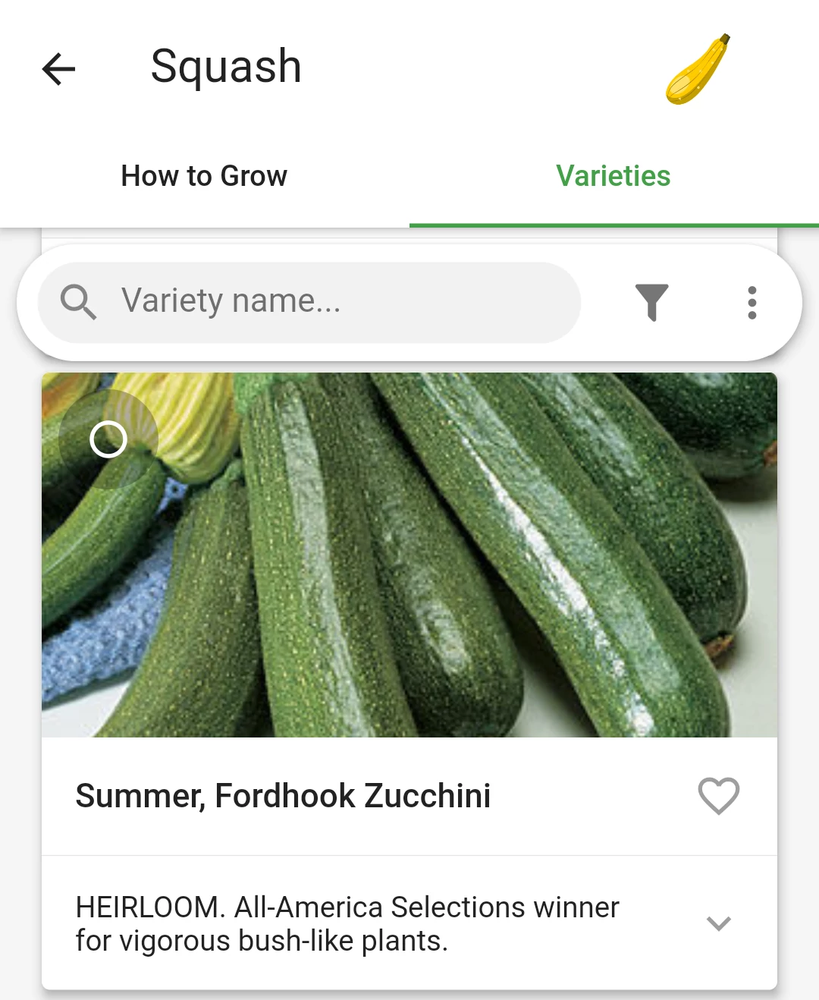

# Plants
{: .no_toc }

  

    Table of contents
  

  {: .text-delta }
1. TOC
{:toc}

## Creating custom plants
If the app does not have a plant you are planting, you can add a custom plant:

1. On the Plants screen (**not** the "Add Plants" dialog in the garden view), tap the "+" button.
2. Enter the plant name.
3. Optionally add a description and other information.
5. Optionally choose an icon and image.
5. Tap "Save".

<iframe width="560" height="315" src="https://www.youtube-nocookie.com/embed/A-6cZsS_s_I" title="YouTube video player" frameborder="0" allow="accelerometer; autoplay; clipboard-write; encrypted-media; gyroscope; picture-in-picture" allowfullscreen></iframe>

## I don't see zucchini, green onions, or red peppers? Where are they?
These are listed in the [varieties]() tab of the plant.

## Why doesn't Planter have {name of plant}?

Please use the "Plants and Feature Requests" forum, which you can find in Settings. If the plant you're looking for has already been requested, please upvote it! This helps us prioritize which plants to add. While you're waiting for me to add it, you can create a custom plant or variety.

## Spacing

In Planter, plants are spaced per square-foot-gardening guidelines. For instance, if you see a circle with 4× in it, that indicates you can plant 4 plants in that square. Each square is one square foot (or 1/9 square meter).